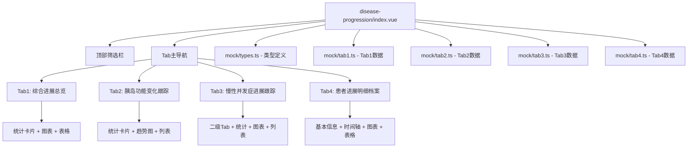

## 产品概述

创建"病情进展"模块，用于跟踪糖尿病患者疾病本身及并发症的进展情况，包括胰岛功能变化、慢性并发症进展等。与"控糖目标"模块（制定目标）和"治疗效果评估"模块（评估结果）形成互补，本模块专注于疾病进展跟踪。

## 核心功能

### 页面布局

- **顶部全局筛选栏**：时间范围、患者分层、并发症类型、患者搜索、查询按钮（仅样式，无真实逻辑）
- **核心主导航**：4个Tab（综合进展总览/胰岛功能变化跟踪/慢性并发症进展跟踪/患者进展明细档案）
- **下方内容区**：根据Tab展示对应内容

### Tab1 综合进展总览

- **6张并发症统计卡片**：无并发症患者、微血管并发症患者、大血管并发症患者、多并发症合并患者、胰岛功能衰退患者、高进展风险患者。每张卡片包含人数、占比、同期变化，卡片名称后带问号图标悬浮显示临床定义
- **2个并排图表**：并发症类型分布饼图、近1年并发症新发/进展趋势折线图
- **2个并排表格**：并发症新发/进展患者TOP20、高进展风险患者列表，仅带"查看详情"按钮

### Tab2 胰岛功能变化跟踪

- **4张胰岛功能分级统计卡片**：胰岛功能正常、胰岛功能轻度减退、胰岛功能中度减退、胰岛功能重度减退
- **近2年全院平均C肽水平变化趋势折线图**
- **患者胰岛功能明细列表**：带"查看详情"按钮

### Tab3 慢性并发症进展跟踪

- **2个二级Tab**：微血管并发症、大血管并发症
- **每个二级Tab下**：
- 4张统计卡片
- 并发症分期分布柱状图
- 并发症进展患者明细列表

### Tab4 患者进展明细档案

- **患者基本信息栏**
- **并发症进展时间轴**
- **胰岛功能变化趋势折线图**
- **并发症历次检查结果对比表**
- **随访进展评估记录列表**

## 设计边界

- 只做糖尿病疾病本身、并发症的进展跟踪
- 不做疗效评估、控糖目标、用药安全相关内容
- 100%纯前端硬编码Mock数据，不写任何API请求

## Mock数据规则

- 全院患者总人数固定200人
- 日期范围：2023-03-01 至 2026-03-31
- 患者姓名、医生姓名用常见中文名
- 所有数据抽离为单独的文件

## 技术栈

- **前端框架**：Vue 3 + TypeScript
- **UI组件库**：Naive UI（NCard, NTabs, NTabPane, NDataTable, NModal, NDescriptions, NDescriptionsItem, NTag, NGrid, NGi, NSelect, NInput, NButton, NTooltip, NTimeline, NTimelineItem）
- **图表库**：ECharts
- **样式**：Tailwind CSS
- **图标**：使用 Naive UI 内置图标 + lucide-vue-next

## 实现方案

### 架构设计

采用单文件组件架构，Mock数据抽离为独立文件，遵循 `treatment-effects` 模块的现有模式：



### 数据结构设计

关键类型定义存储在 `mock/types.ts`：

```typescript
// 并发症类型
export type ComplicationType = '微血管并发症' | '大血管并发症' | '多并发症合并' | '无并发症'

// 胰岛功能分级
export type PancreaticFunctionLevel = '正常' | '轻度减退' | '中度减退' | '重度减退'

// 并发症分期
export type ComplicationStage = '无' | '早期' | '中期' | '晚期'

// 患者基础信息（扩展）
export interface Patient {
  id: number
  name: string
  medicalRecordNo: string
  age: number
  gender: '男' | '女'
  category: PatientCategory
  diabetesType: string
  diseaseDuration: string
  complicationType: ComplicationType
  pancreaticFunction: PancreaticFunctionLevel
  cPeptideLevel: string
  isHighRisk: boolean
  lastCheckDate: string
  mainDoctor: string
}

// 并发症统计卡片
export interface ComplicationCard {
  name: string
  definition: string
  count: number
  percentage: string
  change: string
  trend: 'up' | 'down' | 'stable'
}

// 患者详情
export interface PatientProgressDetail {
  basicInfo: {...}
  complicationTimeline: ComplicationEvent[]
  pancreaticFunctionTrend: CPeptideRecord[]
  examinationResults: ExaminationResult[]
  followUpRecords: FollowUpRecord[]
}
```

### 图表实现要点

- ECharts实例在组件挂载时初始化
- Tab切换时重新渲染当前Tab的图表
- 窗口resize时调用图表resize方法
- 弹窗中的图表需要watch弹窗状态，延迟初始化

## 目录结构

```
src/views/clinical-pharmacy/disease-progression/
├── index.vue           # 主组件
├── mock/
│   ├── types.ts        # 类型定义
│   ├── tab1.ts         # Tab1综合进展总览数据
│   ├── tab2.ts         # Tab2胰岛功能数据
│   ├── tab3.ts         # Tab3慢性并发症数据
│   └── tab4.ts         # Tab4患者进展明细数据
```

## 性能考虑

- 图表懒加载：只有当前激活的Tab才初始化图表
- 表格虚拟滚动：NDataTable自带虚拟滚动（数据量大时启用）
- 避免重复渲染：使用computed缓存计算结果

## 设计风格

采用医疗健康领域专业的数据展示风格，强调信息的清晰度和可读性。使用卡片式布局组织内容，配合图表直观展示数据趋势。与 `treatment-effects` 模块保持一致的设计语言。

## 页面结构

- **顶部筛选栏**：固定高度，灰色背景(#F5F5F5)，筛选控件横向排列
- **Tab导航**：使用Naive UI的NTabs组件，默认选中第一个Tab
- **内容区**：根据Tab展示不同内容，统一使用NCard包裹

## 组件规范

- **统计卡片**：使用NCard，标题+问号图标（NTooltip显示定义），右侧数值，底部变化趋势
- **表格**：使用NDataTable，固定列宽，操作列带"查看详情"按钮
- **图表**：使用ECharts，统一配色方案（与treatment-effects一致）
- **时间轴**：使用NTimeline展示并发症进展时间轴
- **弹窗**：使用NModal，宽度960px，居中显示

## Agent Extensions

### Skill

- **vue-best-practices**
- Purpose: 确保Vue3 Composition API和TypeScript最佳实践，遵循项目编码规范
- Expected outcome: 生成符合Vue3标准的单文件组件代码

- **frontend-design**
- Purpose: 创建高质量的专业医疗数据展示界面
- Expected outcome: 实现美观、专业的UI布局和图表设计