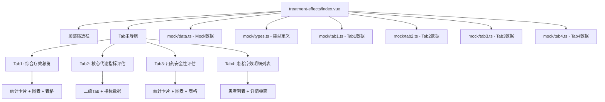

## 产品概述

创建"治疗效果评估"模块，用于结合患者血糖、糖化血红蛋白、肝肾功能、血脂等随访检查结果，全面评估糖尿病治疗效果和用药安全性。与"控糖目标"模块形成互补：控糖目标负责制定目标，治疗效果负责评估结果。

## 核心功能

### 页面布局

- **顶部全局筛选栏**：时间范围/患者分层/疗效分级/搜索框/查询按钮
- **核心主导航**：4个Tab（综合疗效总览/核心代谢指标评估/用药安全性评估/患者疗效明细列表）
- **下方内容区**：根据Tab展示对应内容

### Tab1 综合疗效总览

- 5张疗效分级统计卡片（优秀达标/稳定达标/部分达标/未达标/高风险异常）
- 疗效影响因素对比柱状图 + 近6个月疗效趋势折线图
- 未达标患者TOP20列表 + 高风险异常患者列表

### Tab2 核心代谢指标评估

- 二级Tab：糖代谢指标/脂质代谢指标/肝肾功能指标/其他配套指标
- 每个指标：达标统计卡片 + 异常分布直方图 + 趋势折线图 + 异常患者列表

### Tab3 用药安全性评估

- 4张统计卡片（药物不良反应/肝肾功能异常/用药依从性/药物相互作用风险）
- 不同降糖药不良反应对比图 + 依从性与疗效相关性图
- 药物不良反应记录列表 + 用药高风险患者列表

### Tab4 患者疗效明细列表

- 全量患者表格（10列固定）
- 患者详情弹窗（基本信息/指标对比表/趋势图表/用药安全/随访记录/历史报告）

## 设计边界

- 只做"用既定控糖目标校验治疗结果"
- 不做"制定/修改控糖目标"
- 与控糖目标模块完全不重复

## 技术栈

- **前端框架**：Vue 3 + TypeScript
- **UI组件库**：Naive UI（NCard, NTabs, NDataTable, NModal, NDescriptions, NTag, NGrid, NGi, NSelect, NInput, NButton）
- **图表库**：ECharts 6.0
- **样式**：Tailwind CSS 4.0

## 实现方案

### 架构设计

采用单文件组件架构，**Mock数据抽离为独立文件**便于维护，组件通过import引用数据。



### 数据结构设计

关键数据结构存储在 `mock/types.ts`，需与控糖目标模块保持一致的患者分层定义：

```typescript
// mock/types.ts

// 患者分层（与控糖目标模块一致）
export type PatientCategory =
  | '年轻低危' | '老年衰弱' | '肾功能不全' | '妊娠期' | '手术期' | '心血管高危'

// 疗效评级
export type EfficacyLevel = '优秀达标' | '稳定达标' | '部分达标' | '未达标' | '高风险异常'

// 患者基础信息
export interface Patient {
  id: number
  name: string
  medicalRecordNo: string
  age: number
  gender: string
  category: PatientCategory
  categoryName: string
  diabetesType: string
  diseaseDuration: string
  latestHba1c: string
  efficacyLevel: EfficacyLevel
  overallStatus: '达标' | '未达标' | '部分达标'
  lastFollowUpDate: string
  mainDoctor: string
}

// 代谢指标数据
export interface MetabolicIndex {
  name: string
  unit: string
 达标人数: number
  达标率: string
  异常人数: number
  异常率: string
  较上月变化: string
  正常范围: [number, number]
  目标值: number
}
```

### 图表实现要点

- ECharts实例需要在组件挂载时初始化
- Tab切换时需要重新渲染当前Tab的图表
- 窗口resize时需要调用图表resize方法
- 弹窗中的图表需要watch弹窗状态，延迟初始化

### 文件结构

```
src/views/clinical-pharmacy/treatment-effects/
├── index.vue      # 主组件，引用mock数据
├── mock/
│   ├── types.ts    # 类型定义（PatientCategory, EfficacyLevel等）
│   ├── data.ts     # 通用Mock数据（200患者基础信息）
│   ├── tab1.ts     # Tab1综合疗效总览数据
│   ├── tab2.ts     # Tab2核心代谢指标数据
│   ├── tab3.ts     # Tab3用药安全性数据
│   └── tab4.ts     # Tab4患者疗效列表数据
└── PatientDetailModal.vue  # 患者详情弹窗组件
```

## 性能考虑

- 图表懒加载：只有当前激活的Tab才初始化图表
- 大列表虚拟滚动：NDataTable自带虚拟滚动
- 避免重复渲染：使用computed缓存计算结果

## 设计风格

采用医疗健康领域专业的数据展示风格，强调信息的清晰度和可读性。使用卡片式布局组织内容，配合图表直观展示数据趋势。

## 页面结构

- **顶部筛选栏**：固定高度，灰色背景，筛选控件横向排列
- **Tab导航**：使用Naive UI的NTabs组件，默认选中第一个
- **内容区**：根据Tab展示不同内容，统一使用卡片包裹

## 组件规范

- 统计卡片：使用NCard，左侧标题+右侧数值，底部变化趋势
- 表格：使用NDataTable，固定列宽，斑马纹样式
- 图表：使用ECharts，统一配色方案
- 弹窗：使用NModal，宽度960px，居中显示

## 技能使用

- **vue-best-practices**: 确保Vue3 Composition API和TypeScript最佳实践
- **ui-ux-pro-max**: 优化UI布局和图表设计，确保专业美观